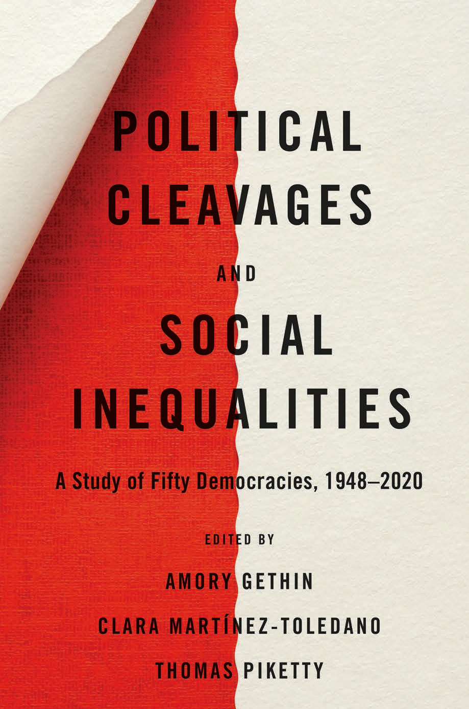

Co-edited with Thomas Piketty and Clara Martínez-Toledano.
Harvard University Press, 2021.

<a class="link2" href="https://wpid.world/">
Book website: World Political Cleavages and Inequality Database
</a>

 
Who votes for whom and why? Why has growing inequality in many parts of the world not led to renewed class-based conflicts, and seems instead to have come with the emergence of new divides over identity and integration? News analysts, scholars, and citizens interested in exploring those questions inevitably lack relevant data, in particular the kinds of data that establish historical and international context. Political Cleavages and Social Inequalities provides the missing empirical background, collecting and examining a treasure trove of information on the dynamics of polarization in modern democracies.

The chapters draw on a unique set of surveys conducted between 1948 and 2020 in fifty countries on five continents, analyzing the links between voters’ political preferences and socioeconomic characteristics, such as income, education, wealth, occupation, religion, ethnicity, age, and gender. This analysis sheds new light on how political movements succeed in coalescing multiple interests and identities in contemporary democracies. It also helps us understand the conditions under which conflicts over inequality become politically salient, as well as the similarities and constraints of voters supporting ethnonationalist politicians like Narendra Modi, Jair Bolsonaro, Marine Le Pen, and Donald Trump.

<h2> Chapters </h2>
(With links to working paper versions)

<a target="_blank" href="https://wpid.world">
Introduction. Objectives and Organization of the Book
</a>

Amory Gethin, Clara Martínez-Toledano, Thomas Piketty

<a target="_blank" href="https://wpid.world">
1. Political Cleavages and Social Inequalities in 50 Democracies, 1948-2020
</a>

Amory Gethin, Clara Martínez-Toledano, Thomas Piketty

<a target="_blank" href="http://piketty.pse.ens.fr/files/Piketty2018.pdf">
2. Brahmin Left vs Merchant Right: Rising Inequality and the Changing
Structure of Political Conflict (France, US, UK)
</a>

Thomas Piketty

<a target="_blank" href="https://wid.world/document/electoral-cleavages-and-socioeconomic-inequality-in-germany-1949-2017-world-inequality-lab-wp-2020-15/">
3. Electoral Cleavages and Socioeconomic Inequality in Germany, 1949-2017
</a>

Fabian Kosse, Thomas Piketty

<a target="_blank" href="https://wid.world/document/changing-party-systems-socio-economic-cleavages-and-nationalism-in-northern-europe-1956-2017-world-inequality-lab-wp-2021-04/">
4. Changing Party Systems, Socioeconomic Cleavages, and Nationalism in
Denmark, Finland, Iceland, Norway, and Sweden

</a>

Clara Martínez-Toledano, Alice Sodano

<a target="_blank" href="https://wid.world/wp-content/uploads/2021/02/WorldInequalityLab_WP2021_05_PoliticalCleavages_AusCanNZ.pdf">
5. Political Cleavages, Class Structures, and the Politics of Old and New
Minorities in Australia, Canada, and New Zealand

</a>

Amory Gethin

<a target="_blank" href="https://wid.world/document/historical-political-cleavages-and-post-crisis-transformations-in-italy-spain-portugal-and-ireland-1953-2020-world-inequality-lab-wp-2021-01/">
6. Historical Political Cleavages and Post-Crisis Transformations in Italy, Spain,
Portugal and Ireland, 1958-2020

</a>

Luis Bauluz, Amory Gethin, Clara Martínez-Toledano, Marc Morgan

<a target="_blank" href="https://wid.world/wp-content/uploads/2021/03/WorldInequalityLab_WP2021_08_PoliticalCleavages_AustriaBelgiumNLSwitzerland.pdf">
7. Party System Transformation and the Structure of Political Cleavages in
Austria, Belgium, the Netherlands, and Switzerland

</a>

Carmen Durrer de la Sota, Amory Gethin, Clara Martínez-Toledano

<a target="_blank" href="https://wid.world/document/political-conflict-social-inequality-and-electoral-cleavages-in-central-eastern-europe-1990-2018-world-inequality-lab-wp-2020-25/">
8. Political Conflict, Social Inequality, and Electoral Cleavages in the Czech
Republic, Hungary, and Poland, 1990-2018

</a>

Attila Lindner, Filip Novokmet, Thomas Piketty, Tomas Zawisza

<a target="_blank" href="https://wid.world/document/growing-cleavages-in-india-evidence-from-the-changing-structure-of-party-electorates-1962-2014-wid-world-working-paper-2019-05/">
9. Caste, Class, and the Changing Political Representation of Social Inequalities
in India, 1962-2019

</a>

Abhijit Banerjee, Amory Gethin, Thomas Piketty

<a target="_blank" href="https://wid.world/wp-content/uploads/2020/08/WorldInequalityLab_WP2020_16_PakistanPoliticalCleavages.pdf">
10. Social Inequality and the Dynamics of Political and Ethnolinguistic Divides
in Pakistan, 1970-2018

</a>

Amory Gethin, Sultan Mehmood, Thomas Piketty

<a target="_blank" href="https://wid.world/document/political-cleavages-and-the-representation-of-social-inequalities-in-japan-1953-2017-world-inequality-lab-wp-2021-10/">
11. Political Cleavages and the Representation of Social Inequalities in Japan,
1953-2017

</a>

Amory Gethin

<a target="_blank" href="https://wid.world/document/democratization-and-the-construction-of-class-cleavages-in-thailand-the-philippines-malaysia-and-indonesia-1992-2019-world-inequality-lab-wp-2021-09/">
12. Democratization and the Construction of Class Cleavages in Thailand, the
Philippines, Malaysia, and Indonesia, 1992-2019

</a>

Amory Gethin, Thanasak Jenmana

<a target="_blank" href="https://wid.world/wp-content/uploads/2021/02/WorldInequalityLab_WP2021_06_PoliticalCleavages_EastAsia.pdf">
13. Inequality, Identity, and the Structure of Political Cleavages in South Korea,
Taiwan, and Hong Kong, 1996-2016

</a>

Carmen Durrer de la Sota, Amory Gethin

<a target="_blank" href="https://wid.world/wp-content/uploads/2021/03/WorldInequalityLab_WP2021_07_PoliticalCleavages_Brazil.pdf">
14. Democracy and the Politicization of Inequality in Brazil, 1989-2018

</a>

Amory Gethin, Marc Morgan

<a target="_blank" href="https://wid.world/wp-content/uploads/2021/03/BLMZ2021.pdf">
15. Social Inequalities, Identity, and Political Cleavages in
Argentina, Chile, Colombia, Costa Rica, Mexico, and Peru, 1952-2019

</a>

Oscar Barrera, Ana Leiva, Clara Martínez-Toledano, Alvaro Zúñiga-Cordero

<a target="_blank" href="https://wid.world/document/extreme-inequality-and-the-structure-of-political-cleavages-in-south-africa-1994-2019-world-inequality-lab-wp-2020-13/">
16. Extreme Inequality, Elite Transformation, and the Changing Structure of
Political Cleavages in South Africa, 1994-2019

</a>

Amory Gethin

<a target="_blank" href="https://wid.world/document/social-inequalities-and-the-politicization-of-ethnic-cleavages-in-botswana-ghana-nigeria-and-senegal-1999-2019-world-inequality-lab-wp-2020-18/">
17. Social Inequalities and the Politicization of Ethnic Cleavages in Botswana,
Ghana, Nigeria, and Senegal, 1999-2019

</a>

Jules Baleyte, Amory Gethin, Yajna Govind, Thomas Piketty

<a target="_blank" href="https://wid.world/document/inequality-identity-and-the-long-run-evolution-of-political-cleavages-in-israel-1949-2019-world-inequality-lab-wp-2020-17/">
18. Inequality, Identity, and the Long-Run Evolution of Political Cleavages in
Israel 1949-2019

</a>

Yonatan Berman

<a target="_blank" href="https://wid.world/wp-content/uploads/2021/03/AGPU2021.pdf">
19. Political Cleavages and Social Inequalities in Algeria, Iraq, and Turkey, 1990-
2019

</a>

Lydia Assouad, Amory Gethin, Thomas Piketty, Juliet Uraz

<a target="_blank" href="https://wpid.world">
Conclusion. Main Takeaways and Research Perspectives 

</a>

Amory Gethin, Clara Martínez-Toledano, Thomas Piketty

<h2> World Political Cleavages and Inequality Database </h2>

The <a target="_blank" href="https://wpid.world">World Political Cleavages and Inequality Database (WPID)</a> is the result of a collaborative research program involving about twenty researchers all around the world. The central aim is to provide open and convenient access to the most extensive available dataset on the structure of political cleavages and social inequalities in electoral democracies, located on the five continents, from the mid-20th century to the present.

<b>Download the data</b>: 
<ol style="line-height: 30px">
  <li><a target="_blank" href="https://wpid.world/resources/en/zip/wpid-macro.zip">Indicators on the structure of the vote by political party in 50 democracies, 1948-2020</a></li>
  <li><a target="_blank" href="https://wpid.world/resources/en/zip/wpid-micro.zip">Harmonized microdata on voting behaviors in 50 democracies, 1948-2020</a></li>
</ol>

<b>Explore the database</b> using <a target="_blank" href="https://explore.wpid.world/">our interactive tool</a>!

<h2> Reviews </h2>

"This book is a breakthrough in the existing literature on the politics of social inequality. Not merely is the analysis intensively data-based, it goes beyond the usual confines of a small number of western democracies to a set of fifty democracies (or semi-democracies) in different continents over many decades. The analysis throughout is highly sensible, informative, and insightful."—<b>Pranab Bardhan</b>, University of California, Berkeley.

"This monumental book presents the first international and historical analysis of political cleavages and of their interplay with inequality. This is a must-read book for anyone wanting to understand electoral politics in today’s democracies—the rise of ‘identity politics’ in some countries but not others, and the multiplicity of possible futures for the dynamic of inequality."—<b>Gabriel Zucman</b>, University of California, Berkeley.

"This impressive book will rapidly become the central reference point for systematically charting trends in voting alignment across the globe. By including nations from the global South alongside established liberal democracies, Gethin and his colleagues challenge endemic Western biases in political research and reveal the systematic ways that inequality and credentialism have redrawn voting patterns over recent decades. Gethin and his coauthors offer exactly the kind of big picture perspective which political activists and campaigners, as much as social scientists, will hugely appreciate."—<b>Mike Savage</b>, author of The Return of Inequality.

"This ambitious collection tackles a set of timely questions about the interplay among inequality levels and trends, political preferences and electoral behavior, and voters’ demographic and economic characteristics. Ideally, the volume will land in the hands of diverse audiences concerned with political polarization and social inequalities—including multidisciplinary social scientists, political actors, and social activists."—<b>Janet C. Gornick</b>, Director, Stone Center on Socio-Economic Inequality at The Graduate Center, City University of New York.

"Here is a welcome throwback to the ambitious political sociology of the mid-twentieth century. The analyses are solid and the geographical range is appealingly broad. The authors’ portraits of shifting social cleavages raise fascinating questions about the nature and implications of ‘class politics’ in the contemporary world."—<b>Larry M. Bartels</b>, Vanderbilt University.

"Combining ambition with humility, this volume explores cross-national and temporal variation in the structure of political cleavages with an eye to explaining the conditions under which income and wealth inequality becomes a topic of political contestation (or not). Refreshingly, the volume sidesteps longstanding debates among political scientists and illustrates how looking for patterns in macro data can yield new insights. Harmonizing election surveys from fifty countries, the database assembled by Piketty and his collaborators itself represents a major contribution."—<b>Jonas Pontusson</b>, University of Geneva.

<h2> Translations </h2>

French: <a target="_blank" href="https://www.seuil.com/ouvrage/clivages-politiques-et-inegalites-sociales-amory-gethin/9782021456479"><em> Clivages politiques et inégalités sociales. Une étude de 50 démocraties (1948-2020) </em></a> (EHESS/Gallimard/Seuil, 2021).

Dutch: <a target="_blank" href="https://www.singeluitgeverijen.nl/de-geus/boek/ongelijkheid-en-ons-stemgedrag/"><em> Ongelijkheid en ons stemgedrag. Een studie van 50 democratieën van 1948 tot 2020 </em></a> (De Geus, 2022).

